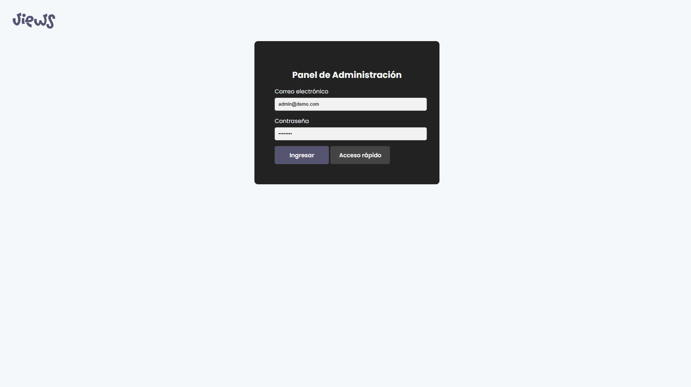
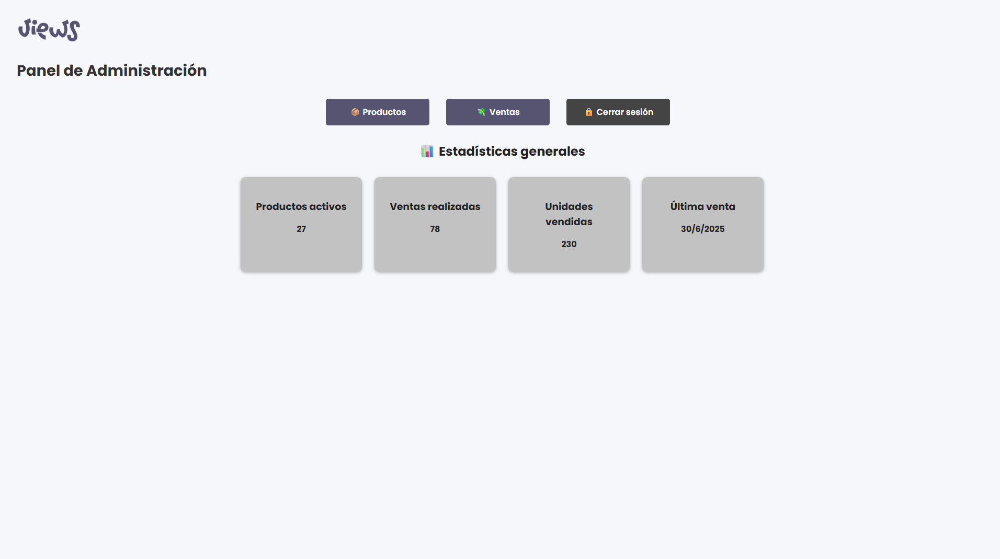
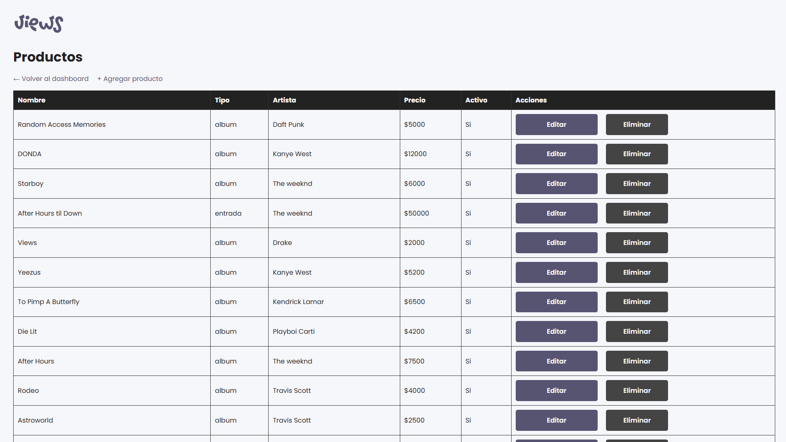
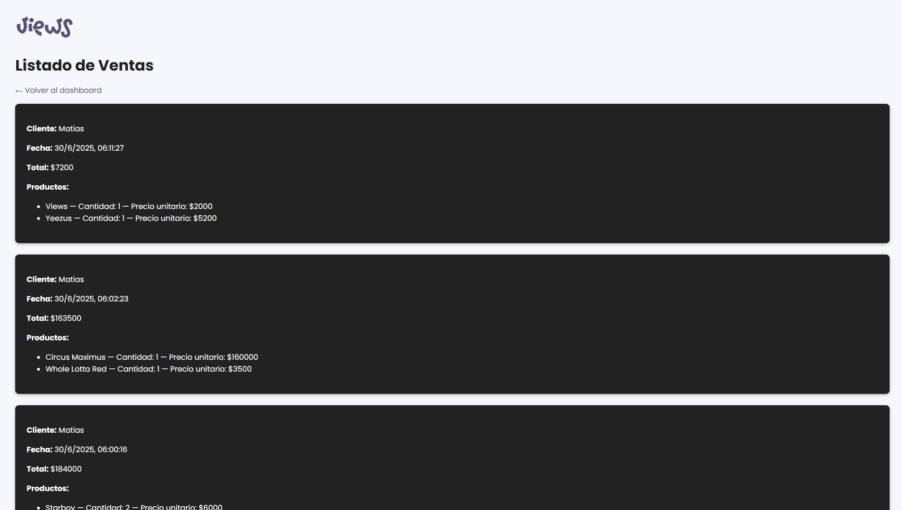
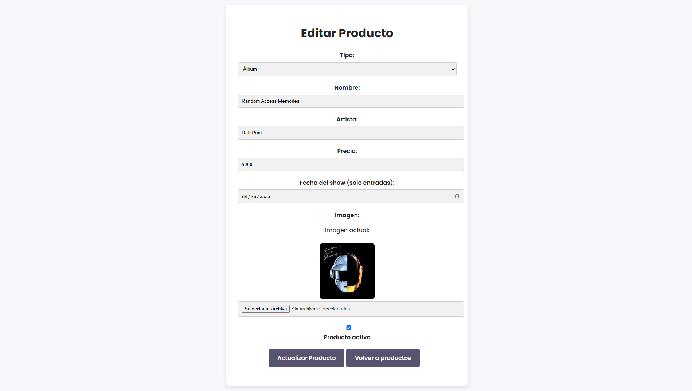
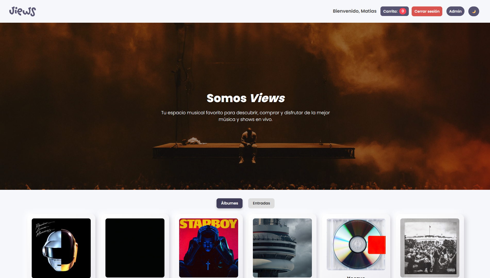
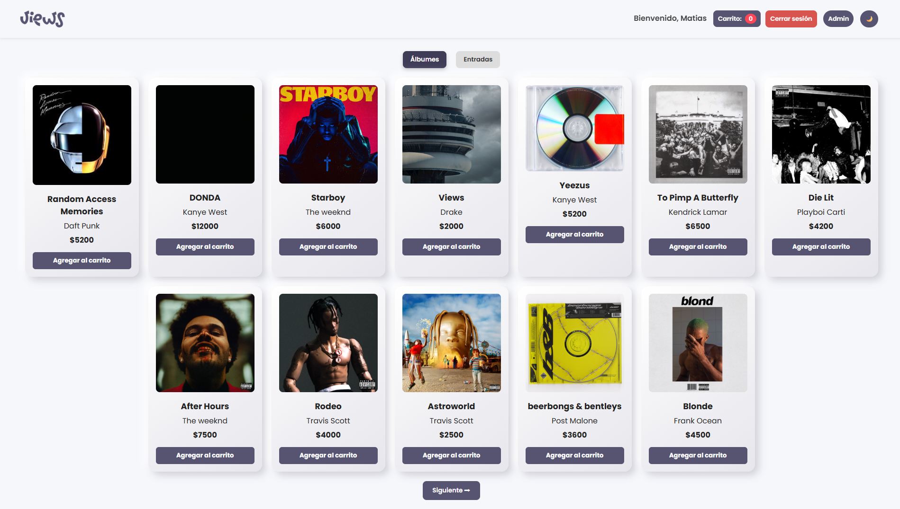
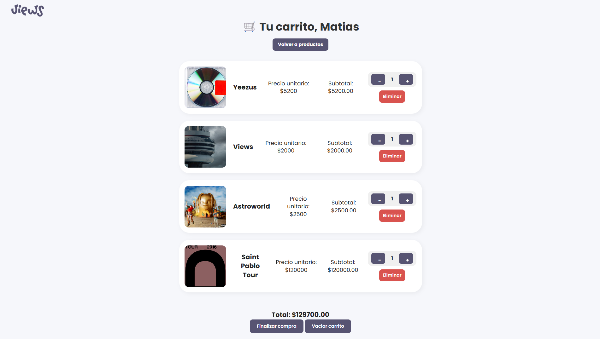
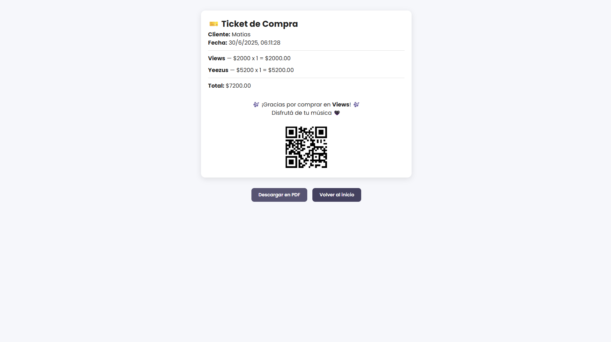

# Views – Programación III


## Sistema de Autoservicio – Gestión de Productos y Ventas

Este proyecto fue desarrollado como parte del **Trabajo Práctico Integrador** de la materia **Programación III**.  
Consiste en un sistema de **autoservicio** dividido en dos partes: un **frontend** para el cliente y un **backend** con panel administrativo. Ambos proyectos se comunican mediante una API REST y permiten una experiencia completa tanto para el usuario final como para el administrador del sistema.

---

## 📁 Estructura del Proyecto

```plaintext
📁 Views
├── backend/
│   ├── config/          
│   ├── controllers/          
│   ├── middlewares/               
│   ├── migrations/               
│   ├── models/               
│   ├── node_modules/               
│   ├── public/               
│   ├── routes/                
│   ├── seeders/                
│   ├── services/                
│   ├── uploads/                
│   ├── views/                
│   ├── .env          
│   ├── app.js           
│   ├── database.sqlite             
│   ├── package-lock.json                
│   ├── package.json                
│   ├── server.js                               
│   └── ...
├── frontend/
│   ├── css/                  
│   ├── img/                  
│   ├── js/                              
│   ├── bienvenida.html            
│   ├── carrito.html            
│   ├── productos.html            
│   ├── ticket.html            
│   └── ...
├── images/                   
├── node_modules/                      
├── .gitignore
├── package-lock.json
└── README.md
```

---

## 🧑‍💻 Tecnologías utilizadas

- **Frontend:** HTML, CSS, JavaScript, EJS, Bootstrap
- **Backend:** Node.js, Express, Sequelize ORM
- **Base de datos:** MySQL
- **Otros:** Multer (carga de imágenes), Bcrypt (encriptación), Express-session

---

## 🚀 Funcionalidades generales

✅ Interfaz responsive (desktop y mobile)  
✅ Dos tipos de productos personalizables  
✅ Compra con carrito y ticket en PDF  
✅ Login seguro para administración  
✅ ABM completo de productos  
✅ Alta y baja lógica  
✅ Paginación  
✅ Cambio de tema (claro / oscuro)  
✅ Registro y visualización de ventas  

---

## 🎯 Pantallas del sistema

### 🔓 Pantalla de Login (Administrador)

Permite iniciar sesión con validación segura. Incluye botón de acceso rápido para testeo.



---

### 🧭 Dashboard (Administrador)

Panel con el listado completo de productos con opciones de editar, eliminar, activar y desactivar productos.



---

### ➕ Vista de productos

Productos activos e inactivos.



---

### ➕ Vista de ventas

Ventas realizadas, con nombre del cliente, productos, cantidades, fecha y total.



---

### ➕ Alta / Modificación de producto

Formulario para agregar o editar productos, con carga de imagen y campos validados.



---

### 👋 Pantalla de Bienvenida (Cliente)

Solicita al usuario su nombre antes de iniciar el proceso de compra.


---

### 🏠 Inicio (Cliente)

Inicio de Views.



---

### 🛍️ Vista de Productos

Muestra productos por categorías, con paginación, tema configurable y botón para cambiar entre claro/oscuro.



---

### 🛒 Carrito

Permite modificar cantidades, eliminar productos y confirmar la compra. Incluye confirmación por modal.



---

### 🧾 Ticket de Compra

Muestra el resumen de compra, nombre del cliente, fecha y total. Permite descargar en PDF y reiniciar el proceso.



---

## 📦 Base de Datos

- Tabla `usuarios` (administradores)
- Tabla `productos` (con imagen, estado activo/inactivo)
- Tabla `ventas`
- Tabla intermedia `venta_producto` para la relación muchos a muchos

---

## ⚙️ Instalación del proyecto

1. Clonar el repositorio:

```bash
git clone https://github.com/matibbaez/views.git
